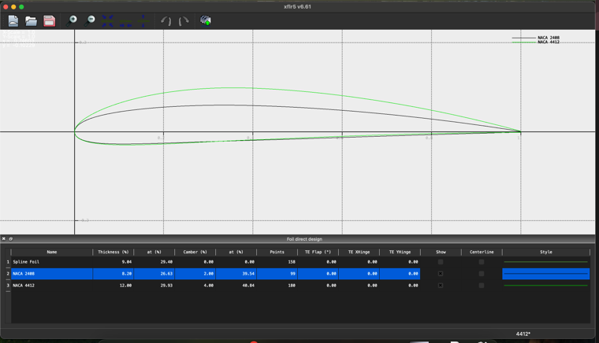
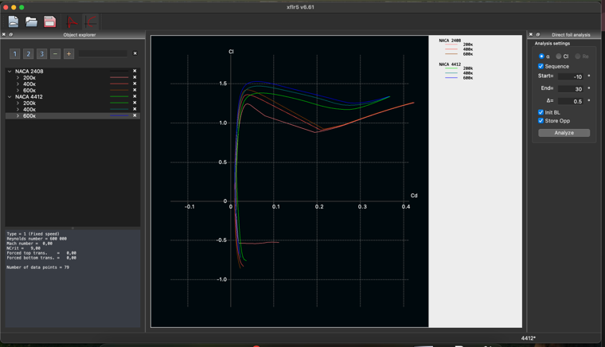
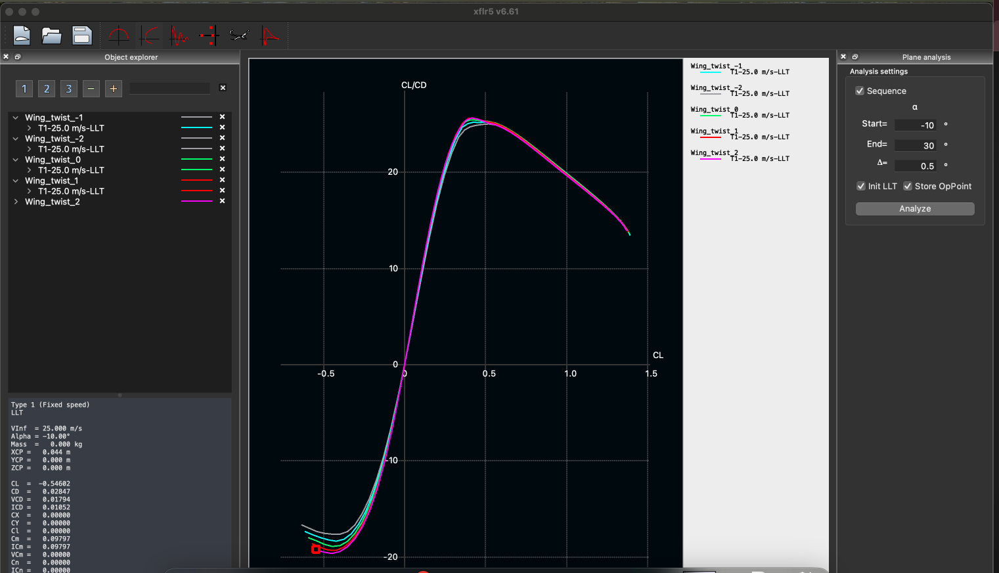
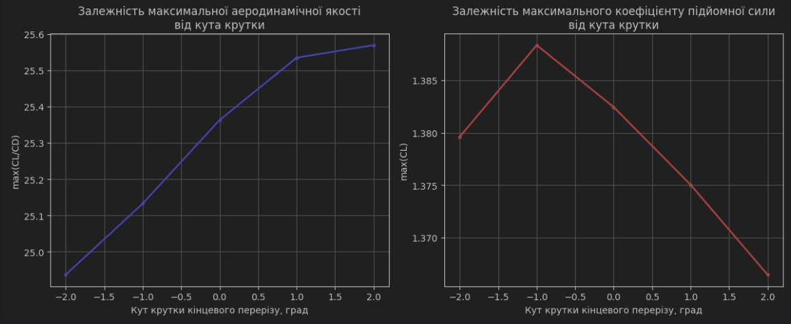

# Лабораторна робота №1
## Дослідження впливу кута крутки на аеродинамічні характеристики крила

### Мета роботи
Дослідити вплив кута крутки крила на його аеродинамічні характеристики та визначити оптимальне значення для максимальної аеродинамічної якості.

### Обладнання та програмне забезпечення

- XFLR5
- Python з бібліотеками matplotlib, numpy, pandas
- Текстовий редактор

### Теоретичні відомості
Крутка крила - це зміна кута установки профілю по розмаху крила. Зазвичай використовується для покращення характеристик звалювання та зменшення індуктивного опору крила.

### Хід роботи

#### 1. Генерація та модифікація профілів

1.1. Генерація профілю NACA 4412

1.2. Генерація профілю NACA 2408

1.3. Модифікація радіусу носика профілю 2408

     
рис. 1 профілі крила NACA2408 зі зміною носика та NACA4412
   

#### 2. Розрахунок характеристик профілів
2.1. Налаштування параметрів розрахунку:
- Діапазон кутів атаки: від -10° до +30° з кроком 0.5°
- Числа Рейнольдса: 2×10⁵, 4×10⁵, 6×10⁵

2.2. Результати розрахунків (графіки):
- Поляри профілів

рис.2 поляри профілів для різних чисел маха (2×10⁵, 4×10⁵, 6×10⁵)

#### 3. Моделювання крила
3.1. Параметри базової геометрії крила
3.2. Створення 5 варіантів з різними кутами крутки:
- -2°, -1°, 0°, +1°, +2°

#### 4. Розрахунок характеристик крила
4.1. Налаштування параметрів розрахунку методом LLT:
- Швидкість потоку: 25 м/с
- Атмосферні умови: стандартні

4.2. Результати розрахунків для кожного варіанту крутки
T1-25_0 m_s-LLT-twist_-2.txt
рис.3 результати розрахунків для кожного варіанту крутки (CL/CD, CL)

#### 5. Обробка результатів
5.1. Програмний код обробки даних на Python lab1AD.ipynb

5.2. Графік залежності max(CL/CD) та max(CL) від кута крутки

5.3. Визначення оптимального значення кута крутки для max(CL/CD) та max(CL)
Результати аналізу:

Залежність max(CL/CD) від кута крутки:

Кут крутки -2°: 24.94

Кут крутки -1°: 25.13

Кут крутки  0°: 25.36

Кут крутки  1°: 25.53

Кут крутки  2°: 25.57

Залежність max(CL) від кута крутки:

Кут крутки -2°: 1.380

Кут крутки -1°: 1.388

Кут крутки  0°: 1.382

Кут крутки  1°: 1.375

Кут крутки  2°: 1.366

Оптимальний кут крутки за критерієм max(CL/CD): 2°

Оптимальний кут крутки за критерієм max(CL): -1°

рис.4 Графік залежності max(CL/CD) та max(CL) від кута крутки

### Висновки

1. За результатами аналізу виявлено, що максимальна аеродинамічна якість крила (CL/CD) досягається при куті крутки +2°. Це вказує на те, що позитивна крутка кінцевого перерізу покращує загальну ефективність крила, ймовірно, за рахунок зменшення індуктивного опору на кінцях крила.

2. Максимальний коефіцієнт підйомної сили досягається при куті крутки -1°. Це говорить про те, що для отримання максимальної підйомної сили більш ефективною є невелика від'ємна крутка, яка забезпечує більш рівномірний розподіл циркуляції по розмаху крила при великих кутах атаки.

3. Різні оптимальні значення кута крутки для різних критеріїв (max(CL/CD) та max(CL)) вказують на необхідність компромісного рішення при проектуванні крила, залежно від пріоритетних вимог до літального апарату:
   - Для крейсерського режиму польоту, де важлива економічність, рекомендується використовувати позитивний кут крутки +2°
   - Для режимів, де критична максимальна підйомна сила (зліт, посадка), більш доцільним є використання невеликої від'ємної крутки -1°

4. Враховуючи специфіку БПЛА, де економічність польоту часто є пріоритетною, рекомендується використовувати позитивний кут крутки +2°, оскільки це забезпечить найкращу аеродинамічну якість в крейсерському режимі польоту.

