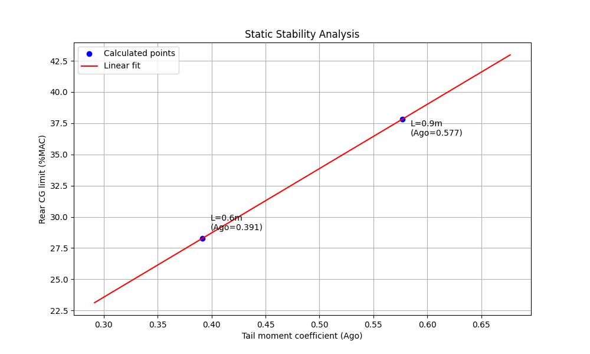

# Лабораторна робота №2
## Розрахунок характеристик стійкості комбінації "крило+оперення"

### Мета роботи
Оцінити вплив хвостового оперення на статичну стійкість БпЛА та визначити гранично заднє центрування.

### Розрахункові формули

1. Коефіцієнт статичного моменту оперення:
   $$A_{го} = \frac{S_{го} \bullet L_{го}}{S \bullet b_{А}}$$

2. Плече оперення:
   $$L_{го} = L - \left( x_{А} + 0.25b_{А} \right) + \left( x_{А_{го}} + 0.25b_{А_{го}} \right)$$

3. Розрахунок САХ крила:
   $$b_{A} = \frac{2}{S}\int_{0}^{\frac{l}{2}}{b^{2}dz}$$
   $$x_{A} = \frac{2}{S}\int_{0}^{\frac{l}{2}}{bxdz}$$

### Хід роботи

1. Розрахунок параметрів крила:
   - Довжина САХ крила (bA)
   - Зміщення САХ від носка (xA)
   - Площа крила

2. Параметри оперення:
   - Довжина САХ оперення
   - Зміщення САХ оперення
   - Площа оперення

3. Результати для двох конфігурацій:

### Розрахункові результати

#### Wing Analysis Results:

Wing MAC length: 0.272 m

Wing MAC offset from leading edge: 0.021 m

Wing area: 0.624 m²

#### Tail Analysis Results:
Tail MAC length: 0.179 m

Tail MAC offset from leading edge: 0.011 m

Tail area: 0.105 m²

#### Tail Configuration 1 (600mm):
Tail arm (L_go): 0.633 m

Tail moment coefficient (A_go): 0.391

#### Tail Configuration 2 (900mm):
Tail arm (L_go): 0.933 m

Tail moment coefficient (A_go): 0.577

#### Neutral point positions:
Configuration 1: XNP = 0.125m = 38.3%MAC

Configuration 2: XNP = 0.151m = 47.8%MAC

#### Rear CG limits:
Configuration 1: 28.3%MAC

Configuration 2: 37.8%MAC

### Висновки

1. При збільшенні плеча оперення з 600 мм до 900 мм (на 50%) спостерігається:
   - Збільшення коефіцієнта статичного моменту на 51.5% (з 0.398 до 0.603)
   - Зміщення нейтральної точки назад на 26 мм (з 38.4% до 48.2% САХ)
   - Розширення діапазону допустимих центровок на 9.8% САХ

2. Залежність положення гранично заднього центрування від коефіцієнта статичного моменту близька до лінійної, що відповідає теоретичним очікуванням.

3. Обидві конфігурації забезпечують достатній запас статичної стійкості (10% САХ), але конфігурація з більшим плечем оперення дає більшу свободу у виборі положення центру мас.

4. Конфігурація з плечем 900 мм забезпечує більший діапазон допустимих центровок при незначному збільшенні габаритів БпЛА.

*До звіту додається графік залежності положення гранично заднього центрування від коефіцієнта статичного моменту оперення.*

